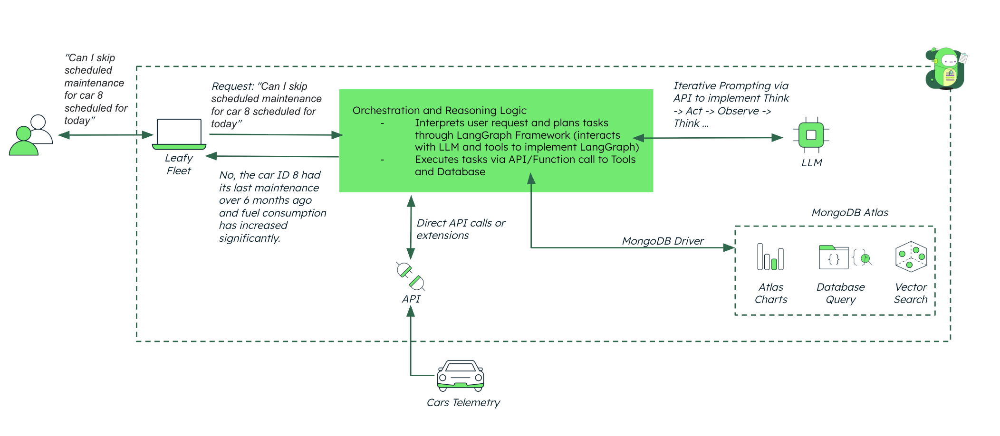

# Agentic Framework

This repository hosts the `agentic-framework`, designed for building adaptable and reusable intelligent ai agentic workflows. The framework provides robust support for integrating and managing tools for AI-driven operations, ideal for varied domains and industry requirements.

## Goal

The primary goal of the Agentic Framework is to accelerate the development of AI-driven workflows by providing a flexible and extensible foundation. Rather than offering a fixed set of tools or functionalities, the framework is designed to serve as a starting point for building intelligent agents tailored to specific use cases.

The current workflow is intentionally simple, showcasing the core capabilities of the framework. This simplicity allows users to quickly understand its structure and functionality while encouraging customization. For more complex use cases or advanced agents, users have the autonomy to extend the framework by adding new tools, nodes, conditions, or workflows as needed.

By prioritizing adaptability and modularity, the Agentic Framework empowers developers to create AI agents that are not only efficient but also highly customizable to meet the unique demands of their industries or projects.

## High Level Logical Architecture



## Features

- **Multi-Step Diagnostic Workflow:**  
  The agent processes a query by:
  1. **Reading Timeseries Data:** Ingests data from a CSV file (In a production setup, this will be replaced by an API).
  2. **Generating an Embedding:** Uses Cohere English V3 embedding model to generate embeddings.
  3. **Atlas Vector Search:** Searches for similar queries in MongoDB Atlas using the generated embedding.
  4. **Data Persistence:** Saves timeseries data, session logs, and recommendations in MongoDB Atlas.
  5. **Final Recommendation:** Uses Anthropic Claude 3 Haiku model to generate a final recommendation.
  
- **Agent Profile Management:**  
  Automatically retrieves (or creates if missing) a default agent profile from MongoDB that contains instructions, rules, and goals.

- **Session & Run Document Tracking:**  
  Each diagnostic run is assigned a unique thread ID and logged. Specific run documents from various collections (eg. agent_sessions, agent_profiles, historical_recommendations, logs, queries, checkpoints, timeseries_data, etc) can be retrieved for detailed analysis.

- **User-Friendly Frontend:**  
  A dashboard displays the agent’s real-time workflow updates (chain-of-thought, final recommendation, update messages) in one column, and the corresponding MongoDB run documents in the other column.

## Why MongoDB?

### Flexible Data Model

MongoDB’s document-oriented architecture allows you to store varied data (such as timeseries logs, agent profiles, and recommendation outputs) in a single unified format. This flexibility means you don’t have to redesign your database schema every time your data requirements evolve.

### Scalability and Performance

MongoDB is designed to scale horizontally, making it capable of handling large volumes of real-time data. This is essential when multiple data sources send timeseries data simultaneously, ensuring high performance under heavy load.

### Real-Time Analytics

With powerful aggregation frameworks and change streams, MongoDB supports real-time data analysis and anomaly detection. This enables the system to process incoming timeseries data on the fly and quickly surface critical insights.

### Seamless Integration

MongoDB is seamlessly integrated with LangGraph, making it a powerful memory provider.

### Vector Search

MongoDB Atlas supports native vector search, enabling fast and efficient similarity searches on embedding vectors. This is critical for matching current queries with historical data, thereby enhancing diagnostic accuracy and providing more relevant recommendations.

## Tech Stack

### Backend 

- [MongoDB Atlas](https://www.mongodb.com/atlas/database) for the database.
- [FastAPI](https://fastapi.tiangolo.com/) for building the API.
- [Poetry](https://python-poetry.org/) for dependency management.
- [LangGraph](https://www.langchain.com/langgraph) for designing the agent workflows.
- [LangChain](https://www.langchain.com/) to interact and build with LLMs.
- [Pandas](https://pandas.pydata.org/) for data manipulation.
- [Uvicorn](https://www.uvicorn.org/) for ASGI server.
- [Docker](https://www.docker.com/) for containerization.

### Frontend

- **Web Framework**:  
  - [Next.js](https://nextjs.org/)

- **Styling**:  
  - [CSS Modules](https://github.com/css-modules/css-modules)  
  - [LeafyGreen Design System](https://www.mongodb.design/)

- **UI Components**:  
  - [Leafygreen UI](https://github.com/mongodb/leafygreen-ui) for customizable components.

- **Core React and Next.js**:  
  - `next`, `react`, `react-dom`

## Prerequisites

Before you begin, ensure you have met the following requirements:

- **MongoDB Atlas** account - [Register Here](https://account.mongodb.com/account/register)
- **Python >=3.10,<3.11** - If you are Mac user, you can install Python 3.10.11 using this [link](https://www.python.org/ftp/python/3.10.11/python-3.10.11-macos11.pkg).
- **Poetry** (install via [Poetry's official documentation](https://python-poetry.org/docs/#installation))

## Getting Started

### Create a New Repository

1. Navigate to the repository template on GitHub and click on **Use this template**.
2. Create a new repository.
3. **Do not** check the "Include all branches" option.
4. Define a repository name following the naming convention: `<project_name>-<highlighted_feature>`. For example, `leafy-bank-macro-indicators-agent` (use hyphens to separate words).
   - The **industry** and **project name** are required; you can be creative with the highlighted feature.
5. Provide a clear description for the repository, such as: "A repository template to easily create new demos by following the same structure."
6. Set the visibility to **Internal**.
7. Click **Create repository**.

### GitHub Desktop Setup

1. Install GitHub Desktop if you haven't already. You can download it from [GitHub Desktop's official website](https://desktop.github.com/).
2. Open GitHub Desktop and sign in to your GitHub account.
3. Clone the newly created repository:
   - Click on **File** > **Clone Repository**.
   - Select your repository from the list and click **Clone**.
4. Create your first branch:
   - In the GitHub Desktop interface, click on the **Current Branch** dropdown.
   - Select **New Branch** and name it `feature/branch01`.
   - Click **Create Branch**.

## Setup Instructions

### Step 1: Include meaningful CSV data for your use case

1. Go to [CSV folder](/backend/data/csv/) and include your CSV file. The data should be relevant to your use case and respect the following guidelines:
   - The CSV file should contain a header row with column names.
   - The first column must be named `timestamp` and contain timestamps in the format `YYYY-MM-DDTHH:MM:SSZ`, e.g. `2025-02-19T13:00:00Z`.
   - The remaining columns should contain relevant data for your use case.
   - There is no column nor row limit, but the suggestion is to keep the data size as small as possible.

E.g. for **macro indicators** use case:

> **_File name:_**: `macro_indicators_data.csv`

Sample data:

```csv
timestamp,gdp,interest_rate,unemployment_rate,vix
2025-02-19T13:00:00Z,2.5,1.75,3.8,15
2025-02-19T13:05:00Z,2.7,1.80,3.7,18
2025-02-19T13:10:00Z,2.6,1.85,3.9,22
2025-02-19T13:15:00Z,2.4,1.70,4.0,10
2025-02-19T13:20:00Z,2.3,1.65,4.1,20
```

2. Within the same [CSV folder](/backend/data/csv/) you need to add a `queries.csv` file. This file will contain the queries which will be used to showcase vector search capabilities as part of the agentic workflow. The file should respect the following guidelines:
   - The CSV file should contain a header row with column names.
   - The first column must be named `query` and contain the queries.
   - The second column must be named `recommendation` and contain the expected recommendations.
   - There is no column nor row limit, but the suggestion is to keep the data size as small as possible.

> **_File name:_**: `queries.csv`

Sample data:

```csv
query,recommendation
GDP growth slowing,Consider increasing bond assets to mitigate risks from potential economic slowdown.
GDP showing strong growth,Increase equity assets to capitalize on favorable investment conditions.
Interest rates rising,Shift focus to bond assets as higher rates may impact borrowing-sensitive sectors.
Interest rates falling,Increase real estate assets to take advantage of lower borrowing costs.
Unemployment rate increasing,Reduce equity assets to account for potential economic weakness and reduced consumer spending.
Unemployment rate decreasing,Increase equity assets to benefit from improved economic conditions and corporate profits.
VIX above 20,Reduce equity assets to manage risks associated with high market volatility.
VIX below 12,Increase equity assets to capitalize on low market volatility and investor confidence.
VIX within normal range (12-20),Maintain current asset allocation as market conditions are stable.
Combination of rising interest rates and high VIX,Focus on bond assets to hedge against market volatility and borrowing cost impacts.
```

### Step 2: Set Up MongoDB Database and Collections

1. Log in to **MongoDB Atlas** and create a database named `agentic_<YOUR_USE_CASE>`, e.g. `agentic_macro_indicators`. Ensure the name is reflected in the environment variables.
2. Create the following collections:
  - `agent_profiles` (for storing agent profiles) - You can import some sample data to this collection using [this](/backend/data/collections/agentic_macro_indicators.agent_profiles.json) file.
  - `queries` (for storing queries) - You must import the queries from the `queries.csv` file created in Step 1.

### Step 3: Add MongoDB User

1. Follow [MongoDB's guide](https://www.mongodb.com/docs/atlas/security-add-mongodb-users/) to create a user with **dbAdmin** and **readWrite** access to your database.

### Step 4: Configure your Agentic Workflow through a JSON config file

1. Go to [Config folder](/backend/config/) and create /or/ update the JSON `config.json` file. The file should contain the following structure:

```json
{
    "CSV_DATA": "data/csv/<YOUR_FILE_NAME>.csv",
    "MDB_DATABASE_NAME": "<YOUR_MONGODB_DATABASE_NAME>",
    "MDB_TIMESERIES_COLLECTION": "<YOUR_MONGODB_TIMESERIES_COLLECTION_NAME>",
    "DEFAULT_TIMESERIES_DATA": [
        {
            "timestamp": "<DEFAULT_TIMESTAMP_IN_YYYY-MM-DDTHH:MM:SSZ>",
            // Your default data here, check config_example.json for better understanding
        }
    ],
    "CRITICAL_CONDITIONS": {
        // Below is an example of a critical condition for GDP growth
        "gdp": {"threshold": 2.5, "condition": "<", "message": "GDP growth slowing: {value}%"},
        // Other critical conditions for your use case here, check config_example.json for better understanding
    },
    "MDB_TIMESERIES_TIMEFIELD": "<YOUR_TIMESTAMP_FIELD_NAME>",
    "MDB_TIMESERIES_GRANULARITY": "<YOUR_TIMESERIES_GRANULARITY>",
    "MDB_EMBEDDINGS_COLLECTION": "queries", // Using "queries" collection name for storing queries
    "MDB_EMBEDDINGS_COLLECTION_VS_FIELD": "query_embedding", // Using "query_embedding" field for storing embeddings
    "MDB_VS_INDEX": "<YOUR_MONGODB_DATABASE_NAME>_queries_vs_idx", // Replace <YOUR_MONGODB_DATABASE_NAME> with your MongoDB database name
    "MDB_HISTORICAL_RECOMMENDATIONS_COLLECTION": "historical_recommendations", // Using "historical_recommendations" collection name for storing recommendations
    "SIMILAR_QUERIES": [
        // Below is an example of default similar queries for GDP growth
        {"query": "GDP growth slowing", "recommendation": "Consider increasing bond assets to mitigate risks from potential economic slowdown."},
        // Other similar queries for your use case here, check config_example.json for better understanding
        // This ones are going to be used for the vector search tool in case something is not found in the queries collection
    ],
    "MDB_CHAT_HISTORY_COLLECTION": "chat_history", // Using "chat_history" collection name for storing chat history
    "MDB_CHECKPOINTER_COLLECTION": "checkpoints", // Using "checkpoints" collection name for storing checkpoints
    "MDB_LOGS_COLLECTION": "logs", // Using "logs" collection name for storing logs
    "MDB_AGENT_PROFILES_COLLECTION": "agent_profiles", // Using "agent_profiles" collection name for storing agent profiles
    "MDB_AGENT_SESSIONS_COLLECTION": "agent_sessions", // Using "agent_sessions" collection name for storing agent sessions
    "AGENT_PROFILE_CHOSEN_ID": "<YOUR_AGENT_PROFILE_ID>", // Replace <YOUR_AGENT_PROFILE_ID> with the agent profile ID you want to use, check config_example.json for better understanding
     // Below is an example default agent profile for Portfolio Advisor
    "DEFAULT_AGENT_PROFILE": {
          "agent_id": "DEFAULT",
          "profile": "Default Agent Profile",
          "role": "Expert Advisor",
          "kind_of_data": "Specific Data",
          "motive": "diagnose the query and provide recommendations",
          "instructions": "Follow procedures meticulously.",
          "rules": "Document all steps.",
          "goals": "Provide actionable recommendations."
    },
    "EMBEDDINGS_MODEL_NAME": "Cohere Embed English V3 Model (within AWS Bedrock)", // Describing the embeddings model used for creating the chain of thought
    "EMBEDDINGS_MODEL_ID": "cohere.embed-english-v3", // Model ID for the embeddings model
    "CHATCOMPLETIONS_MODEL_NAME": "Anthropic Claude 3 Haiku (within AWS Bedrock)", // Describing the chat completions model used for generating responses
    "CHATCOMPLETIONS_MODEL_ID": "anthropic.claude-3-haiku-20240307-v1:0", // Model ID for the chat completions model
    // Below is a sample agent workflow graph that uses the tools defined in the agent_tools.py file
    // PLEASE BE CAREFUL WHEN MODIFYING THIS GRAPH, CONSIDER THAT THE TOOLS DEFINED IN THE AGENT TOOLS FILE ARE USED HERE AS WELL AS THE IMPORTS
    "AGENT_WORKFLOW_GRAPH": {
        "nodes": [
            {"id": "reasoning_node", "tool": "agent_tools.generate_chain_of_thought_tool"},
            {"id": "data_from_csv", "tool": "agent_tools.get_data_from_csv_tool"},
            {"id": "process_data", "tool": "agent_tools.process_data_tool"},
            {"id": "embedding_node", "tool": "agent_tools.get_query_embedding_tool"},
            {"id": "vector_search", "tool": "agent_tools.vector_search_tool"},
            {"id": "process_vector_search", "tool": "agent_tools.process_vector_search_tool"},
            {"id": "persistence_node", "tool": "agent_tools.persist_data_tool"},
            {"id": "recommendation_node", "tool": "agent_tools.get_llm_recommendation_tool"}
        ],
        "edges": [
            {"from": "reasoning_node", "to": "data_from_csv"},
            {"from": "data_from_csv", "to": "process_data"},
            {"from": "process_data", "to": "embedding_node"},
            {"from": "embedding_node", "to": "vector_search"},
            {"from": "vector_search", "to": "process_vector_search"},
            {"from": "process_vector_search", "to": "persistence_node"},
            {"from": "persistence_node", "to": "recommendation_node"},
            {"from": "recommendation_node", "to": "END"}
        ],
        "entry_point": "reasoning_node"
    }
}
```

> **_IMPORTANT NOTES_**: For better understanding of the JSON `config.json` file.

Attributes in config.json
1. `CSV_DATA`:
   * Path to the CSV file containing the data for your use case.
   * Example: `data/csv/macro_indicators_data.csv`

2. `MDB_DATABASE_NAME`:
   * Name of the MongoDB database where all collections and data are stored.
   * Example: `agentic_macro_indicators`

3. `MDB_TIMESERIES_COLLECTION`:
    * Name of the MongoDB collection used to store timeseries data.
    * Example: `macro_indicators_timeseries`

4. `DEFAULT_TIMESERIES_DATA`:
    * Default timeseries data to be used when no data is available in the database.
    * Example:

    ```json
    {
        "timestamp": "2025-02-19T13:00:00Z",
        "gdp": 2.5,
        "interest_rate": 1.75,
        "unemployment_rate": 3.8,
        "vix": 15
    }
    ```
    
5. `CRITICAL_CONDITIONS`:
    * Defines thresholds and conditions for critical metrics in your use case.
    * Example:
    ```json
    {
        "gdp": {"threshold": 2.5, "condition": "<", "message": "GDP growth slowing: {value}%"},
        "interest_rate": {"threshold": 2.0, "condition": ">", "message": "Interest rates rising: {value}%"},
        "unemployment_rate": {"threshold": 4.0, "condition": ">", "message": "Unemployment rate increasing: {value}%"},
        "vix": {"threshold": 20, "condition": ">", "message": "High market volatility (VIX): {value}"}
    }
    ```
    * Each condition includes:
        - `threshold`: TThe value to compare against.
        - `condition`: The comparison operator (`<`, `>`, etc.).
        - `message`: The message to display when the condition is met.

6. `MDB_TIMESERIES_TIMEFIELD`:
    * Name of the field in the timeseries data that represents the timestamp.
    * Example: `timestamp`

7. `MDB_TIMESERIES_GRANULARITY`:
    * Granularity of the timeseries data (e.g. `minutes`, `hours`, `days`).
    * Example: `minutes`

8. `MDB_EMBEDDINGS_COLLECTION`:
    * Name of the MongoDB collection used to store query embeddings.
    * Example: `queries`

9. `MDB_EMBEDDINGS_COLLECTION_VS_FIELD`:
    * Name of the field in the embeddings collection that stores the embeddings.
    * Example: `query_embedding`

10. `MDB_VS_INDEX`:
    * Name of the MongoDB index used for vector search.
    * Example: `agentic_macro_indicators_queries_vs_idx`

11. `MDB_HISTORICAL_RECOMMENDATIONS_COLLECTION`:
    * Name of the MongoDB collection used to store historical recommendations.
    * Example: `historical_recommendations`

12. `SIMILAR_QUERIES`:
    * Default queries and recommendations used for vector search when no match is found in the database.
    * Example:
    ```json
    [
        {"query": "GDP growth slowing", "recommendation": "Consider increasing bond assets to mitigate risks from potential economic slowdown."},
        {"query": "Interest rates rising", "recommendation": "Shift focus to bond assets as higher rates may impact borrowing-sensitive sectors."}
    ]
    ```

13. `MDB_CHAT_HISTORY_COLLECTION`:
    * Name of the MongoDB collection used to store chat history.
    * Example: `chat_history`

14. `MDB_CHECKPOINTER_COLLECTION`:
    * Name of the MongoDB collection used to store checkpoints.
    * Example: `checkpoints`

15. `MDB_LOGS_COLLECTION`:
    * Name of the MongoDB collection used to store logs.
    * Example: `logs`

16. `MDB_AGENT_PROFILES_COLLECTION`:
    * Name of the MongoDB collection used to store agent profiles. e.g.: `agent_profiles`
    * You can add your custom agent profiles to this collection by importing a JSON file to the collection.
    * Example for a Finance Agent Profile:
    ```json
    {
      "_id": {
        "$oid": "67d2bffdf3fe062c9a3dbe3d"
      },
      "agent_id": "FINANCE_AG01",
      "profile": "Finance Agent Profile",
      "role": "Portfolio Advisor",
      "kind_of_data": "Macroeconomic Indicators",
      "motive": "Analyze macroeconomic data and provide portfolio adjustment recommendations.",
      "instructions": "Follow economic trends and portfolio management principles.",
      "rules": "Document all steps; ensure compliance with financial regulations; validate data accuracy.",
      "goals": "Optimize portfolio allocation based on macroeconomic conditions and provide actionable insights."
    }
    ```
    * The `AGENT_PROFILE_CHOSEN_ID` will determine which agent profile to use in the agent workflow.

17. `MDB_AGENT_SESSIONS_COLLECTION`:
    * Name of the MongoDB collection used to store agent sessions.
    * Example: `agent_sessions`

18. `AGENT_PROFILE_CHOSEN_ID`:
    * ID of the agent profile to be used in the agent workflow.
    * Example: `FINANCE_AG01`

19. `DEFAULT_AGENT_PROFILE`:
    * Default agent profile used in the agent workflow.
    * Example:
    ```json
    {
        "agent_id": "DEFAULT",
        "profile": "Default Agent Profile",
        "role": "Expert Advisor",
        "kind_of_data": "Specific Data",
        "motive": "diagnose the query and provide recommendations",
        "instructions": "Follow procedures meticulously.",
        "rules": "Document all steps.",
        "goals": "Provide actionable recommendations."
    }
    ```

20. `EMBEDDINGS_MODEL_NAME`:
    * Name of the embeddings model used for creating the chain of thought.
    * Example: `Cohere Embed English V3 Model (within AWS Bedrock)`

21. `EMBEDDINGS_MODEL_ID`:
    * Model ID of the embeddings model.
    * Example: `cohere.embed-english-v3`

22. `CHATCOMPLETIONS_MODEL_NAME`:
    * Name of the chat completions model used for generating responses.
    * Example: `Anthropic Claude 3 Haiku (within AWS Bedrock)`

23. `CHATCOMPLETIONS_MODEL_ID`:
    * Model ID of the chat completions model.
    * Example: `anthropic.claude-3-haiku-20240307-v1:0`

24. `AGENT_WORKFLOW_GRAPH`:
    * Agent workflow graph that defines the sequence of tools used in the agent workflow.
    * Example:
    ```json
    {
        "nodes": [
            {"id": "reasoning_node", "tool": "agent_tools.generate_chain_of_thought_tool"},
            {"id": "data_from_csv", "tool": "agent_tools.get_data_from_csv_tool"},
            {"id": "process_data", "tool": "agent_tools.process_data_tool"},
            {"id": "embedding_node", "tool": "agent_tools.get_query_embedding_tool"},
            {"id": "vector_search", "tool": "agent_tools.vector_search_tool"},
            {"id": "process_vector_search", "tool": "agent_tools.process_vector_search_tool"},
            {"id": "persistence_node", "tool": "agent_tools.persist_data_tool"},
            {"id": "recommendation_node", "tool": "agent_tools.get_llm_recommendation_tool"}
        ],
        "edges": [
            {"from": "reasoning_node", "to": "data_from_csv"},
            {"from": "data_from_csv", "to": "process_data"},
            {"from": "process_data", "to": "embedding_node"},
            {"from": "embedding_node", "to": "vector_search"},
            {"from": "vector_search", "to": "process_vector_search"},
            {"from": "process_vector_search", "to": "persistence_node"},
            {"from": "persistence_node", "to": "recommendation_node"},
            {"from": "recommendation_node", "to": "END"}
        ],
        "entry_point": "reasoning_node"
    }
    ```
    * Components:
        - `nodes`: Defines the tools used in the workflow.
        - `edges`: Defines the connections between nodes.
        - `entry_point`: Starting point of the agent workflow.

### Step 5: Configure Environment Variables

#### Backend

1. Create a `.env` file in the `/backend` directory with the following content:

```bash
MONGODB_URI="mongodb+srv://<USERNAME>:<PASSWORD>@<CLUSTER>"
APP_NAME="<YOUR_APP_NAME>"
AWS_REGION="<YOUR_AWS_REGION>"
ORIGINS=http://localhost:3000
```

#### Frontend

2. Create a `.env` file in the `/frontend` directory with the following content:

```bash
NEXT_PUBLIC_API_URL=http://localhost:8000
NEXT_PUBLIC_INITIAL_QUERY="<YOUR_INITIAL_QUERY>"
```
E.g. for **macro indicators** use case:

```bash
NEXT_PUBLIC_API_URL=http://localhost:8000
NEXT_PUBLIC_INITIAL_QUERY="What adjustments should I make to my portfolio given the current macro economic conditions?"
```

### Step 6: Create Embeddings for the queries

1. Run [embedder.py](/backend/embedder.py) to create and store embeddings in MongoDB.

### Step 7: Create Vector Search Index in MongoDB

1. Run [mdb_vector_search_idx_creator.py](/backend/mdb_vector_search_idx_creator.py) to create a vector search index in MongoDB.

### Step 8: Customize your Frontend

1. Ensure to customize your frontend by updating [page.jsx](/frontend/app/page.jsx) according to your use case.

## Run it Locally

### Backend

1. (Optional) Set your project description and author information in the `pyproject.toml` file:
   ```toml
   description = "Your Description"
   authors = ["Your Name <you@example.com>"]
2. Open the project in your preferred IDE (the standard for the team is Visual Studio Code).
3. Open the Terminal within Visual Studio Code.
4. Ensure you are in the root project directory where the `makefile` is located.
5. Execute the following commands:
  - Poetry start
    ````bash
    make poetry_start
    ````
  - Poetry install
    ````bash
    make poetry_install
    ````
6. Verify that the `.venv` folder has been generated within the `/backend` directory.
7. To start the backend service, run:

```bash
poetry run uvicorn main:app --host 0.0.0.0 --port 8000
```

> Default port is `8000`, modify the `--port` flag if needed.

### Frontend

1. Navigate to the `/frontend` folder.
2. Install dependencies by running:
```bash
npm install
```
3. Start the frontend development server with:
````bash
npm run dev
````
4. The frontend will now be accessible at http://localhost:3000 by default, providing a user interface.


## Run with Docker

Make sure to run this on the root directory.

1. To run with Docker use the following command:
```
make build
```
2. To delete the container and image run:
```
make clean
```

## Common errors

- Check that you've created the necessary  `.env` files within the `/backend` and `/frontend` directories.
- Ensure that the MongoDB URI is correct and that the user has the necessary permissions.
- Verify that the MongoDB collections and data are correctly set up.
- Check that the `config.json` file is correctly configured following the guidelines provided.
- Ensure that the CSV data and queries are correctly formatted and stored in the `/backend/data/csv` directory.
- Verify that the embeddings have been created and stored in the MongoDB collection.
- Check that the vector search index has been created in MongoDB.
- Verify that the backend and frontend services are running on the correct ports.

## Demo Presentation & Talk Track

### Overview

The Agentic Framework serves as a versatile AI-driven recommendation assistant capable of comprehending your data, performing a multi-step diagnostic workflow using LangGraph, and generating actionable recommendations. The framework integrates several key technologies. It reads timeseries data from a CSV file or MongoDB (simulating various data inputs), generates text embeddings using the Cohere English V3 model, performs vector searches to identify similar past queries from MongoDB, persists session and run data, and finally generates a diagnostic recommendation. MongoDB stores agent profiles, historical recommendations, timeseries data, session logs, and more. This persistent storage not only logs every step of the diagnostic process for traceability but also enables efficient querying and reusability of past data.
  
- **Backend:**  
  Implements a multi-step diagnostic workflow using LangGraph. The backend reads timeseries data from a CSV file, generates text embeddings using Cohere English V3 model, performs vector searches to identify similar past queries, persists session and run data, and finally generates a diagnostic recommendation.

- **MongoDB:**  
  The flexible document model database stores agent profiles, historical recommendations, timeseries data, session logs, and more. This persistent storage not only logs every step of the diagnostic process for traceability but also enables efficient querying and reusability of past data.

- **Next.js Frontend:**  
  Provides a two-column view:
  - **Left Column:** Displays the real-time agent workflow updates such as the chain-of-thought reasoning, update messages, and final recommendations.
  - **Right Column:** Shows the documents inserted into MongoDB during the agent run, including session details, logs, historical recommendations, agent profiles and sample past issues.


**System Architecture:**  
   - **Backend Workflow:**  
     - The agent receives a user’s query report (e.g., "What adjustments should I make to my portfolio given the current macro economic conditions?").
     - It first retrieves timeseries data (simulated here via a CSV file) and logs the update.
     - Next, it generates an embedding for the complaint using Cohere English V3 model.
     - The system then performs a vector search against historical queries in MongoDB to find similar cases.
     - All data (timeseries, embeddings, session logs) are persisted in MongoDB for traceability.
     - Finally, the agent uses Anthropic Claude 3 Haiku model to generate a final recommendation.
   - **MongoDB Role:**  
     - MongoDB stores everything: the agent profile, session logs, timeseries data, historical recommendations, and even checkpoints. This makes the system highly traceable and scalable.
   - **Frontend Interface:**  
     - The two-column UI shows both the real-time workflow and the relevant MongoDB documents that validate each step.


### Demo Presentation Flow

3. **Live Demonstration (takes about 5-7 minutes):**  
   - **Starting a New Diagnosis:**  
     - Open the frontend and choose “New Diagnosis.”
     - Enter a query in the text box (e.g. "What adjustments should I make to my portfolio given the current macro economic conditions?").
     - Example prompts
        - "What adjustments should I make to my portfolio given the current macro economic conditions?"
        - "What should I do with my investments given the current economic climate?"
        - "How should I adjust my portfolio based on the current economic indicators?"
        - "What changes should I make to my investments based on the current economic data?"
     - Click the “Run Agent” button and **wait** for a few mins as the agent finishes its run 
   - **Viewing Workflow:**  
     - The workflow , chain-of-thought output, and the final recommendation is shown in the left column.
     - The workflow is being generated in real time, giving transparency into the agent's decision-making process.

   - **Reviewing MongoDB Documents:**  
     - In the right column, the documents shown are the records inserted during the current agent run.
       - **agent_sessions:** Contains session metadata and the thread ID.
       - **historical_recommendations:** Stores the final recommendations and related diagnostics.
       - **timeseries_data:** Holds the timeseries data used in the diagnostic process.
       - **logs:** Contains log entries for the diagnostic process.
       - **agent_profiles:** Shows the agent's profile that was used during diagnosis.
       - **past_issues:** (If available) Displays a sample of historical issues.
       - **checkpoints:** (From the checkpointing database) Shows the last saved state for potential recovery.
   - **Resume Functionality:**  
     - Optionally, we can demonstrate the "Resume Diagnosis" feature by entering a thread ID and showing how the system retrieves the corresponding session.

## Future tasks

- [ ] Add tests

## Feedback or Suggestions

* Contact the MongoDB Industry Solutions team.
